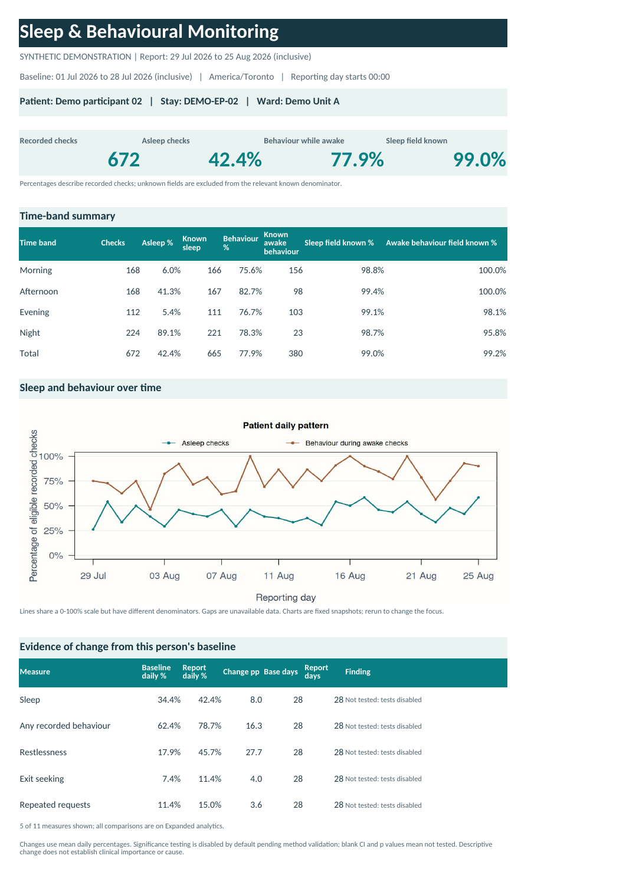

# Sleep & Behavioural Monitoring

[](https://github.com/dfrbagley-cpu/sleep-behaviour-monitoring/actions/workflows/checks.yml)

**Turn sleep and behaviour observations into a review-ready report, without
copying R results into an Excel template.**

Built for analysts preparing inpatient clinical and program reviews: compare a
person's recorded patterns with their earlier observations, inspect individual
behaviours, and review ward context alongside the underlying data.

[Download the two editions](https://github.com/dfrbagley-cpu/sleep-behaviour-monitoring/releases/latest)
· [Engineering case study](docs/CASE_STUDY.md)
· [Hospital setup](hospital/START_HERE.md)
· [Advanced guide](advanced/README.md)

This public development preview uses generated fictional records. It rebuilds a
workflow from the author's earlier hospital-used R tool; **this implementation
has not been clinically validated or accepted for hospital deployment**. Reuse
terms are [pending](LICENSING.md).



*Synthetic example of the generated Excel dashboard. No patient data is shown.*

## Two editions, one calculation engine

| Edition | Intended use | What runs today |
| --- | --- | --- |
| **Hospital R Tool** | A versioned folder copied to an approved workstation or shared drive | RStudio launcher; automatic four-sheet Excel workbook, HTML report and CSV summaries |
| **Advanced Development Version** | Continued development and evaluation in this repository | The shared reporting tool plus a separate demographic-summary and retrospective forecast-evaluation command |

The hospital package excludes the advanced research code and requires Excel
output. Both packages contain byte-identical shared calculation modules. Research
changes can be evaluated without changing the hospital entry point. See the
[edition boundaries and roadmap](docs/TWO_EDITIONS.md).

## Try the synthetic demo

Install R, download and extract the **Advanced-Development** ZIP or clone this
repository, then run these commands from its folder:

```sh
Rscript --vanilla run.R --demo
Rscript --vanilla advanced/run.R --demo
```

Open the HTML paths printed by each command. The first produces the monitoring
report; the second produces the research report. Both work with base R and need
no patient data, account or database connection. The demo has eight fictional
people across two fictional units and 56 days, split into 28 baseline days and
28 report days.

To add automatic Excel output and support for unencrypted XLSX input, install
the optional packages once:

```sh
Rscript --vanilla scripts/install_optional.R
Rscript --vanilla run.R --demo
```

Package installation needs internet access. Normal report generation runs
locally without network calls. Each run writes a new output folder; existing
reports are not overwritten.

For the **Hospital** ZIP, open `check_setup.R` and then `run_hospital.R` in
RStudio and click **Source** on each. The default is a synthetic run. R and
`openxlsx` must already be installed; `readxl` is needed only for XLSX input.
The [hospital guide](hospital/START_HERE.md) covers local paths and setup.

## The report

The monitoring command generates a self-contained HTML report, CSV summaries,
source/configuration fingerprints and a run receipt. With `openxlsx`, it also
generates `monitoring-report.xlsx`:

| Worksheet | What the reviewer can do |
| --- | --- |
| **Dashboard** | Review the selected person's summary, sleep and behaviour together over time, and daily-mean changes with data-availability notes |
| **Expanded analytics** | Inspect each configured behaviour, changes from the person's baseline and descriptive ward-peer comparisons |
| **Raw data** | Filter and search selected original rows alongside derived fields |
| **Documentation** | Check metric definitions, source fields, settings, methods and data-quality notes |

Charts are generated automatically. Rerun the tool after changing inputs or
settings: editing workbook cells does not recalculate the reports or charts.

## What the numbers mean

- **Sleep:** asleep observations divided by observations with a known sleep state.
- **Behaviour:** behaviour recorded among confirmed-awake observations, divided
  by confirmed-awake observations with a known behaviour status.
- **Missing values:** unknown remains unknown; it does not become absence.
- **Earlier baseline:** comparisons match the same person, admission and unit.
- **Ward peers:** the focused person is excluded across all their admissions;
  results are descriptive and do not adjust for patient mix.

The report shows numerators, denominators and recorded-field completeness.
Completeness among received rows cannot identify scheduled checks that were never
recorded. Point observations do not establish measured sleep duration, a
medication effect or a clinical cause.

The default statistical panel shows observed daily-mean changes and available
days. **Experimental significance testing is disabled by default and rejected by
the hospital runner.** Its calibration is not established; see the
[methods and limitations](docs/STATISTICS.md).

## Advanced analysis: implemented and planned

| Available now | Further work |
| --- | --- |
| Demographic summaries by age band, recorded sex and diagnostic group; unmatched records remain in Unknown groups | Demographic adjustment and justified additional predictors |
| Minimum-contributor rules for cohort rates | Representative subgroup evaluation and a defined disclosure policy |
| Past-only comparison of yesterday's value against a trailing seven-day mean on the same eligible next-day targets | Clinically useful prediction targets, fitted models and external evaluation |
| Fixed 14-day retrospective evaluation window, eligibility counts and mean absolute errors | Prospective forecasts and operational deployment |

Demographic summaries are **stratification, not adjustment**. The backtest
evaluates recorded percentages; it does not provide prospective patient risk
scores or treatment recommendations. Synthetic results demonstrate software
behaviour, not predictive usefulness.

## Adapt an export locally

Copy `config/site.example.dcf` outside the repository and map your source columns,
codes, dates and time zone. Keep local inputs, configuration and outputs outside
the repository.

```sh
Rscript --vanilla run.R --config "/local/site.dcf" --input "/local/observations.csv" --output "/local/reports/run-001"
```

Use real local paths and a new or empty output directory. Input requires stable
observation, patient and admission identifiers, unit, timestamp, sleep state and
behaviour status. The normalized timestamp needs seconds and an explicit UTC
offset or `Z`. Verify the source mapping and representative outputs before
replacing the existing workflow. See [configuration](docs/CONFIGURATION.md),
[migration](docs/MIGRATION.md) and the hospital setup guide.

For exports with separate date/time fields or different headings, the
[hospital input adapter](docs/IMPORT_ADAPTER.md) creates a mapped observation
file and matching report configuration. It requires explicit formats and offsets
and checks split local timestamps against the configured time zone. Encrypted
XLSX import is not implemented.

Local reports contain supplied identifiers and are not encrypted by the tool.
The workbook includes **every original column** within its selected raw-data
scope. Review that scope before sharing. Do not put patient records, real reports,
credentials or internal configuration in GitHub issues or commits.

## Engineering and verification

One `R/` core validates, normalizes and summarizes observations. The hospital and
development runners reuse it; `advanced/` adds cohort joins and retrospective
evaluation. Site mappings are non-executable DCF configuration files.

```sh
Rscript --vanilla tests/run_tests.R
Rscript --vanilla tests/test_editions.R
Rscript --vanilla tests/test_advanced.R
Rscript --vanilla tests/test_import.R
python tests/test_release.py
python scripts/build_editions.py
```

Synthetic checks cover hand-calculated denominators, unknown/conflicting states,
duplicates, date boundaries, baseline and peer selection, report escaping,
workbook output, edition parity and future-data leakage. CI runs on Linux and
Windows. Release builds include only named source files and verify SHA-256
manifests and shared-core parity.

Start with the [engineering case study](docs/CASE_STUDY.md) for the design
decisions and trade-offs, or the [source review](docs/SOURCE_REVIEW.md) for the
calculation defects addressed. [Contributions](CONTRIBUTING.md) should include a
small synthetic reproduction. See [security reporting](SECURITY.md) for sensitive
findings and [licensing status](LICENSING.md) for reuse terms.
